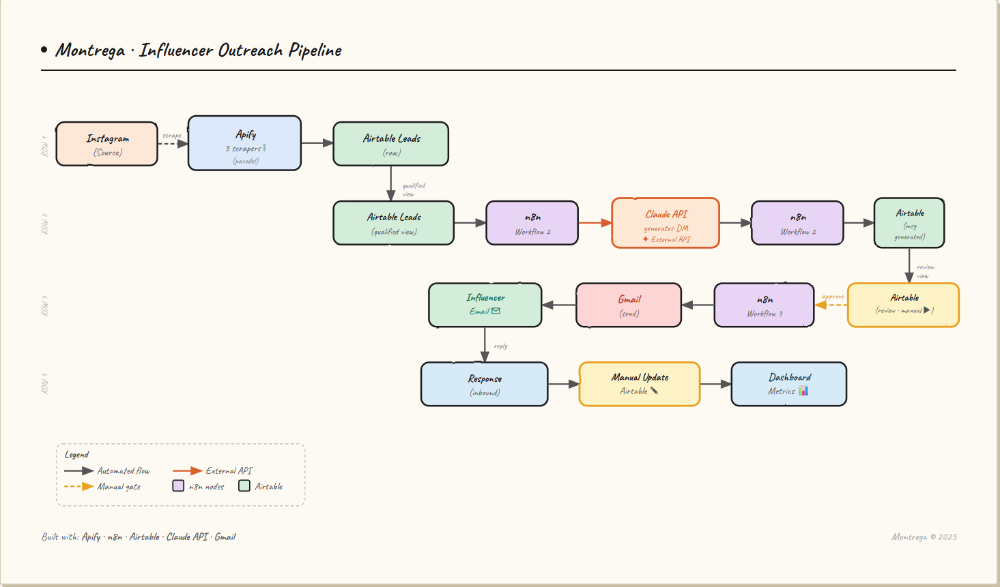

# Montrega Influencer Pipeline

AI-integrated influencer outreach system for a D2C 
fragrance brand. Built on n8n, Airtable, and Claude API.

## The Problem

Manually sourcing and personalizing outreach to nano-
influencers (1K to 80K followers) for Montrega took 
2 to 3 hours per 10 qualified leads. Personalization 
quality dropped after the first 5 messages as 
attention fatigued. The work was the rate limiter on 
our influencer-led acquisition channel.

## The Solution

A 3-workflow pipeline that sources, qualifies, 
personalizes, and tracks influencer outreach using 
off-the-shelf tools and Claude API for the 
personalization layer.

Pipeline reduces per-message time from approximately 
18 minutes (manual) to approximately 8 seconds 
(automated generation + 10s human review).

## Architecture



Three n8n workflows running on a self-hosted n8n 
instance on Railway:

1. Ingestion: triggers Apify scrapers, writes raw 
   profiles to Airtable
2. Enrichment (LLM CHain): triggers on Airtable record 
   qualification, calls Claude API for personalized 
   message, writes back
3. Sending: triggers on human approval, sends via 
   Gmail, updates tracking fields

## Stack

- n8n (self-hosted on Railway, Postgres backend)
- Anthropic Claude API (claude-haiku-4-5)
- Apify (Instagram Profile, Hashtag, Followers 
  scrapers)
- Airtable (CRM, qualification, tracking)
- Gmail (delivery channel)

## Qualification Logic

```
IF(
  AND(
    {Followers} >= 1000,
    {Followers} <= 80000,
    {Business email} = "TRUE"
  ),
  "✓",
  "✗"
)
```

See airtable_schema.md for full schema.

## Prompt Engineering

The Claude prompt went through 2 iterations before 
reaching acceptable output quality (4 of 5 messages 
passing review without edits). See 
prompt_iterations.md for the diff between versions 
and the rationale for each change.

## What I Would Build Next

1. Quality scoring loop: a second Claude call that 
   rates the first call's output on personalization 
   quality before storing
2. UTM tracking on collaboration links to attribute 
   collaboration-driven revenue to specific 
   influencer outreach campaigns
3. Reply parsing automation: when an influencer 
   responds, classify as interested/declined/follow-
   up needed
4. Niche classification node: instead of manually 
   tagging niche, Claude classifies from bio

## Cost

Approximately $5/month total operating cost:
- n8n self-host: $5/month on Railway
- Anthropic Claude: ~$0.50 per 100 messages 
  generated
- Apify: $5 free tier per month, covers ~1,500 
  profile lookups
- Airtable: free tier supports the schema

## Why n8n

Considered Make.com and Zapier. Chose n8n for three 
reasons:
1. Workflow portability: JSON export means the 
   system is committable to Git as a reproducible 
   artifact (which is what this repo demonstrates)
2. Cost economics: self-hosted unlimited executions 
   vs Zapier's 750 tasks per month at $19.99
3. Visual debugging: n8n's execution view shows 
   exactly what data passed between each node, which 
   was critical during prompt iteration

## Caveats

- The Airtable record-based trigger has a polling 
  delay of 1 to 15 minutes depending on plan. For 
  real-time use, replace with an Airtable webhook 
  via a paid Airtable plan.
- Instagram TOS prohibits automated DM sending, so 
  this pipeline targets email-based outreach only. 
  Instagram outreach is manual.
- Claude API rate limits apply. Pipeline includes 
  retry-on-fail logic with 10-second backoff.
